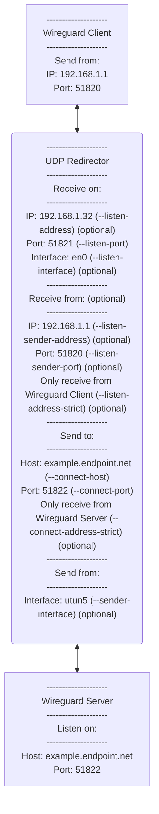

# udp-redirect
A simple yet flexible and very fast UDP redirector. Tested on Linux x64 and MacOS / Darwin arm64.

Useful for redirecting UDP traffic (e.g., Wireguard VPN) where doing it at a different layer (e.g., from a firewall) is challenging / impossible. Does not modify the redirected packets.


[](https://www.gnu.org/licenses/old-licenses/gpl-2.0.en.html)

**Community contributions are welcome.**

## Security

Supports enforcing the packet source for all received packets. This only provides modest security improvements as generating UDP packets is trivial.

## Compile

```# make```

or

```# gcc udp-redirect.c -o udp-redirect -Wall -O3```

## Run

```
./udp-redirect \
    --listen-port 51821 \
    --connect-host example.endpoint.net --connect-port 51822
```

```
./udp-redirect \
    --debug \
    --listen-address 192.168.1.32 --listen-port 51821 --listen-interface en0 \
        --listen-address-strict \
    --connect-host example.endpoint.net --connect-port 51822 \
        --connect-address-strict \
    --send-interface utun5 \
    --listen-sender-address 192.168.1.1 --listen-sender-port 51820
```



# Documentation

Doxygen generated documentation in [docs](docs/)/index.html

# Command Line Arguments

```udp-redirect [arguments]```

Runs in foreground and expects external process control (svscan, nohup, etc.)

## Debug

| Argument | Parameters | Req/Opt | Description |
| --- | --- | --- | --- |
| ```--verbose``` | | *optional* | Verbose mode, can be specified multiple times. |
| ```--debug``` | | *optional* | Debug mode (e.g., very verbose). |
| ```--stats``` | | *optional* | Display send/receive and resource consumption every 60 seconds. |

## Listener

The UDP sender (e.g., wireguard client) sends packets to the UDP redirector here.

| Argument | Parameters | Req/Opt | Description |
| --- | --- | --- | --- |
| ```--listen-address``` | address | *optional* | Listen address. |
| ```--listen-port``` | port | *required* | Listen port. |
| ```--listen-interface``` | interface | *optional* | Listen interface name. |
| ```--listen-address-strict``` | | *optional* | **Security:** By default, packets received from the connect endpoint will be sent to the source of the last packet received on the listener endpoint. In ```listen-address-strict``` mode, only accept packets from the same source as the first packet, or the source specified by ```listen-sender-address``` and ```listen-sender-port```. |

## Connect

The UDP redirector sends packets here (e.g., to the wireguard server):

| Argument | Parameters | Req/Opt | Description |
| --- | --- | --- | --- |
| ```--connect-address``` | address | *required* | Connect address. |
| ```--connect-host``` | address | *required* | Connect host, overwrites ```connect-host``` if both are specified. |
| ```--connect-port``` | port | *required* | Connect port. |
| ```--connect-address-strict``` | | *optional* | **Security**: Only accept packets from ```connect-host``` / ```connect-port```, otherwise accept from all sources. |

# Sender

The UDP redirector sends packets from here (e.g., to the wireguard server). If any is missing, it will be selected by the operating system (usually ```0.0.0.0```, random port, default interface).

| Argument | Parameters | Req/Opt | Description |
| --- | --- | --- | --- |
| ```--send-address``` | address | *optional* | Send packets from address. |
| ```--send-port``` | port | *optional* | Send packets from port. |
| ```--send-interface``` | interface | *optional* | Send packets from interface. |

# Listener security

Both must be specified; listener drops packets if they do not arrive from this address / port.

| Argument | Parameters | Req/Opt | Description |
| --- | --- | --- | --- |
| ```--listen-sender-address``` | address | *optional* | Listen endpoint only accepts packets from this source address. |
| ```--listen-sender-port``` | port | *optional* | Listen endpoint only accepts packets from this source port (must be set together, ```--listen-strict``` is implied). |

# Miscellaneous

| Argument | Parameters | Req/Opt | Description |
| --- | --- | --- | --- |
| ```--ignore-errors``` | | *optional* | Ignore most receive or send errors (host / network unreachable, etc.) instead of exiting. *(default)* |
| ```--stop-errors``` | | *optional* | Stop on most receive or send errors (host / network unreachable, etc.) |
